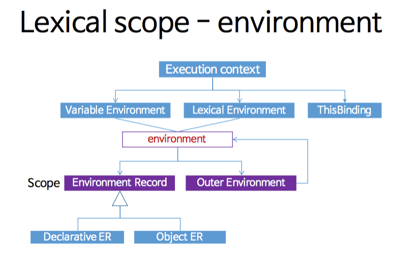

## Table of Contents

- [Table of Contents](#table-of-contents)
- [Intro](#intro)
- [Contents](#contents)
  - [1. Hoisting](#1-hoisting)
  - [2. TDZ(Temporal Dead Zone)](#2-tdztemporal-dead-zone)
  - [3. 블록 레벨 스코프(Block-level-scope)](#3-블록-레벨-스코프block-level-scope)
  - [4. Global](#4-global)
  - [5. (Re-)Assign](#5-re-assign)
- [Outro](#outro)
- [References](#references)

## Intro

이번에는 면접에도 종종 물어보게되는 var, let, const 대해서 간략히 설명해보고자 합니다.
너무나 많은 블로그에서 많은 설명을 해주었기 떼문에 예제를 통해서 간략하게 알아보겠습니다.

## Contents

### 1. Hoisting

해당 질문을 받으면, 첫번째로 언급해야되는 것은 변수의 생성 순서입니다.
자바스크립트에서 변수는 보통 `선언 > 초기화 > 할당`을 구분되어 생성됩니다. 또한, 이 3가지를 구분하여 var, let, const를 구분할 수도 있습니다.

```js
// VAR
console.log(foo); // undefined
var foo;
console.log(foo); // undefined
```

1. var는 호이스팅된다는 것을 알 수 있습니다. console.log보다 나중에 선언되었음에도 불구하고 not defined가 아닌 undefined가 출력되기 때문입니다.
2. var는 선언과 함께 초기화가 발생된다는 것을 알 수 있습니다. undefined가 출력되는 것을 보고 알 수 있습니다.

```js
console.log(boo); // Uncaught ReferenceError: boo is not defined
let boo;
console.log(foo); // undefined
```

```js
console.log(coo); // Uncaught SyntaxError: Missing initializer in const declaration
const coo;
```

1. let, const는 선언 전에 값을 참조할 수 없습니다. 이 사실로, let과 const가 호이스팅이 되지 않는다고 착각하기 쉽습니다. 하지만, 에러메세지를 보면 var, let, const를 구분하고 있다는 것을 눈치채칠 수 있습니다. 즉, let과 const는 호이스팅되는 것은 맞습니다.
2. let과 const가 에러가 나는 이유는 TDZ(Temporal Dead Zone)에 대한 언급과 Scope의 개념으로 설명되어야 하므로 순서대로 예제코드를 통해 설명드리도록 하겠습니다.
3. const는 var, let과 다르게 생성과 함께 초기화가 되지 않습니다. 그러므로, 선언을 하면 메모리에 초기화되지 않기 때문에, Missing initializer 에러가 발생됩니다. 그러므로, const는 항상 값을 할당해주어야 생성과 함께 초기화될 수 있습니다.

> 여기서 중요한 것은, 호이스팅은 선언단계에서 발생된다.

### 2. TDZ(Temporal Dead Zone)

이미 우리는 위 예제에서 TDZ를 맛보았습니다.

하지만, 위의 예제로 TDZ를 명하기에는 부족함이 많습니다. 간략하게 TDZ에 대해 짚고 넘어가보고자 합니다.

let, const의 선언은, 실행중인 실행 컨텍스트의 어휘적 환경으로서 어휘적 환경 내에서 지정된 변수를 정의됩니다.
즉, 변수는 어휘적 환경에 포함되지만 어휘적 환경이 바인딩 되기 전까지 실행 될 수 없습니다.

그러므로, let과 const는 어휘정 환경 내에서 실행이 되어야만 해당 값을 에러 없이 확인 할 수 있습니다.

> NHN에서 스코프와 클로져에 대해서 상당히 글을 잘 써주었습니다. 읽으면 큰 도움이 될 것입니다. 아래 그림만 보아도 많은 도움이 됩니다.



```js
function isDev() {
  return dev;
}
console.log(isDev()); //Uncaught ReferenceError: dev is not defined
let dev = true;
```

```js
let dev = true;
function isDev() {
  return dev;
}
console.log(isDev()); //true
```

### 3. 블록 레벨 스코프(Block-level-scope)

코드로 알아봅시다. let과 const는 블록 레벨 스코프(Block-level-scope)입니다.

> 블록 레벨 스코프란, 코드 블록 내에서만 유효하며 코드 블록 외부에서는 참조할 수 없습니다. 즉, 코드 블록 내부에서 선언한 변수는 지역 변수입니다.

```js
function isDev(name) {
  if (name === 'seolhun') {
    var dev = true;
  }
  return dev;
}
console.log(isDev('seolhun')); //true
console.log(isDev('hun')); //undefined
```

var는 함수레벨 스코프이기 때문에, if의 블록을 넘어서 isDev에서 참조가 가능합니다.

```js
const isDev = (name) => {
  if (name === 'seolhun') {
    let dev = true;
    return dev;
  }
  return dev;
};
console.log(isDev('seolhun')); //true
console.log(isDev('hun')); //Uncaught ReferenceError: dev is not defined
```

let은 블록 레벨 스코프이기 때문에, if문 밖에서 메모리가 수거되며 참조할 수 없습니다.

### 4. Global

let은 var와 다르게 전역변수에 포함되지 않는다.

위에서 언급했듯이 let은 블록레벨 스코프로서, 보이지 않는 블록 내에 존재하는 것으로 이해하면 쉽다.

```js
var foo = 123;
console.log(window.foo); // 123
```

```js
let foo = 123;
console.log(window.foo); // 123
```

### 5. (Re-)Assign

const는 보통 상수로 많이 사용됩니다. const는 재할당이 되지 않습니다.

```js
const IS_DEV = process.env.NODE_ENV === 'development';
IS_DEV = false; // Uncaught TypeError: Assignment to constant variable.
```

하지만, 재밌는것은 Array와 Object내에 인덱스 값을 변경(추가/삭제 등)하거나, 키 값을 추가하는 등의 행위는 허용됩니다.
그렇기 때문에, Immutable 같은 라이브러리나 [Object.freeze()](https://developer.mozilla.org/ko/docs/Web/JavaScript/Reference/Global_Objects/Object/freeze)와 같은 API가 존재합니다.

```js
let apple = 3;
apple = 5;
```

let은 이렇게 재할당이 가능합니다.

> 상수로서 사용되지는 않기 때문에, 소문자로 선언하였습니다.

## Outro

var, let, const만을 이해하기 위해서도 호이스팅과 스코프 등 다양한 Javascript의 지식이 필요합니다.
다 믾은 기능을 나열하자면 끝도 없지만, 개인적인 기준으로 나열한 것들만 이해하여도 큰 도움이 될 것이라고 생각합니다.

이제는 너무도 당연하게 const, let부터 배우게 되며, var를 사용할 일은 거의 없을 것입니다.
간혹, SDK와 같은 모든 브라우저 호환 라이브러리를 만드는 전문적인 자바스크립트 엔지니어가 되지 않는이상, 주로 사용될 확률은 높지 않습니다.
그럼에도 불구하고 이렇게 정리하는 이유는, 각각의 기능의 차이점을 이해하고 새로운 기능의 배경을 이해하면, 현재의 자바스크립에 대해서 더 잘 이해할 것이라고 믿기에 간략히 정리해보았습니다.

읽어주셔서 감사합니다.

## References

- [TC39 - sec-let-and-const-declarations](https://tc39.es/ecma262/#sec-let-and-const-declarations)
- [Ponyfoo - es6-let-const-and-temporal-dead-zone-in-depth](https://ponyfoo.com/articles/es6-let-const-and-temporal-dead-zone-in-depth)
- [NHN - Scope and Closure](https://meetup.toast.com/posts/86)
- [PromiseWeb - es6-block-scope](https://poiemaweb.com/es6-block-scope)
